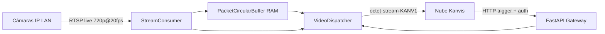

# Kanvis Edge Video Gateway

Gateway de vídeo en el edge para retail: mantiene un búfer circular en RAM con paquetes H.264/H.265 **sin decodificar** y entrega a la nube, bajo demanda, los ~6 s de pasado más ~24 s de presente cuando la Fase 1 detecta una interacción.

## Arquitectura

| Módulo | Responsabilidad |
|--------|-----------------|
| **A — `discovery/`** | Escaneo LAN (RTSP/ONVIF) e inventario CRUD (`cameras.json` o SQLite) |
| **B — `ingestion/`** | `StreamConsumer` por cámara (PyAV, codec copy) + `PacketCircularBuffer` |
| **C — `api/`** | FastAPI: `GET /api/v1/stream/{camera_id}` con `StreamingResponse` |
| **D — `services/`** | DDNS (DuckDNS/No-IP) y middleware API Key / JWT |



## Requisitos

- Python 3.11+
- FFmpeg/libs (PyAV) en el host o contenedor
- Cámaras accesibles por RTSP en la LAN

## Inicio rápido

```bash
cp .env.example .env
cp config/config.yaml.example config/config.yaml
# Editar config/cameras.json y API_KEY en .env

python -m venv .venv && source .venv/bin/activate
pip install -r requirements.txt
export PYTHONPATH=.
python -m src.main
```

### Docker

```bash
cp .env.example .env
docker compose up -d --build
```

Build multi-arquitectura (ejemplo):

```bash
docker buildx build --platform linux/amd64,linux/arm64 -t kanvis-edge:latest .
```

## API principal

| Método | Ruta | Descripción |
|--------|------|-------------|
| `GET` | `/api/v1/health` | Salud (público) |
| `GET` | `/api/v1/config` | Resumen de configuración global (auth) |
| `GET` | `/api/v1/stream/{camera_id}` | Clip evento: pre + post en vivo (auth) |
| `GET` | `/api/v1/playback/{camera_id}?offset_sec=3` | Playback desde (ahora − N s) (auth) |
| `GET/POST/PUT/DELETE` | `/api/v1/cameras` | CRUD inventario (sin reiniciar el proceso) |

### Inventario de cámaras (`config/cameras.json`)

Esquema anidado (ver `config/cameras.schema.json`):

- `source` — RTSP entrada (host, port, path, credenciales)
- `output` — relay RTSP / WebRTC (preparado Fase 1–2)
- `buffer` — `duration_seconds` (default 60), offsets de playback y evento

Formato plano legacy (`ip_address`, `rtsp_path`, …) sigue siendo válido; se migra al cargar.

### Búfer y playback (Fase 0)

- Búfer en RAM recortado por **tiempo real** (`BUFFER_DURATION_SECONDS`, default 60).
- `GET /api/v1/playback/{id}?offset_sec=3` — prueba “3 s atrás”.
- `GET /api/v1/playback/{id}?offset_sec=6` — uso nube (6 s atrás).
- El clip de evento **no vacía** el búfer (permite varias peticiones).

### RTSP passthrough / relay (Fase 1)

Por cámara en `output.relay`:

| Campo | Descripción |
|-------|-------------|
| `enabled` | Activa el subproceso FFmpeg |
| `mode` | `listen` (servidor en el edge) o `push` (hacia URL remota) |
| `listen_port` / `path_suffix` | `rtsp://EDGE_IP:8554/cam-01` |
| `push_url` | Destino si `mode=push` (sin abrir puertos en router) |
| `force_transcode_gop` | `true` → H.264 con I-frame cada `iframe_interval_sec` (~3 s) |

```bash
# Activar relay en cameras.json → relay.enabled=true, luego:
curl -H "X-API-Key: KEY" -X POST http://127.0.0.1:8000/api/v1/cameras/cam-01/relay/start
curl -H "X-API-Key: KEY" http://127.0.0.1:8000/api/v1/cameras/cam-01/relay/status
# Reproducir en VLC: rtsp://IP_DEL_EDGE:8554/cam-01
```

Requiere **ffmpeg** instalado en el host (`apt install ffmpeg`).

### RTSP gateway unificado (Fase 7, opcional)

Un **solo puerto** en el router hacia el edge; rutas por cámara vía **MediaMTX** (`RTSP_GATEWAY_ENABLED=true`).

| `output.gateway.access_mode` | Comportamiento |
|------------------------------|----------------|
| `gateway` | `rtsp://DDNS:55422/cam-01` → proxy edge → cámara LAN |
| `direct` | Sin proxy; abre PF WAN → cámara `:554` (comparar latencia) |
| `relay` | Usa FFmpeg listen (Fase 1), puerto distinto por cámara |

Guía completa: [`docs/RTSP_GATEWAY.md`](docs/RTSP_GATEWAY.md).

```bash
curl -H "X-API-Key: KEY" http://127.0.0.1:8000/api/v1/gateway/status
```

### WebRTC (Fase 2)

| Modo | Uso | Endpoint |
|------|-----|----------|
| `whep` | Visor en navegador / cliente WebRTC | `POST /api/v1/webrtc/{id}/offer` con `{sdp, type}` |
| `whip` | Push hacia nube/servidor WHIP | `POST /api/v1/webrtc/{id}/whip` |
| rewind | Ver desde N s atrás en la sesión activa | `POST /api/v1/webrtc/{id}/rewind?offset_sec=3` |

En `cameras.json` → `output.webrtc`: `enabled`, `mode`, `signaling_url` (WHIP), `stun_urls`, `rewind_offset_sec`.

La pista WebRTC decodifica H.264 solo en salida; el búfer RAM sigue en codec copy.

### Pruebas de cámara (Fase 3)

| Acción | Método | Ruta |
|--------|--------|------|
| Frame cámara original | `GET` | `/api/v1/cameras/{id}/snapshot/source` → JPEG |
| Frame tras relay | `GET` | `/api/v1/cameras/{id}/snapshot/relay` → JPEG (relay activo) |
| Iniciar rebroadcast | `POST` | `/api/v1/cameras/{id}/broadcast/start` |
| Parar rebroadcast | `POST` | `/api/v1/cameras/{id}/broadcast/stop` |
| Probar playback | `POST` | `/api/v1/cameras/{id}/test/playback` → metadatos + URL |
| Stream prueba | `GET` | `/api/v1/cameras/{id}/test/playback/stream?offset_sec=3` |

Requiere **ffmpeg** y cámara con ingesta activa (`/status` → `ingest.connected`).

### Panel web (Fase 4)

1. Configura en `.env`: `WEBUI_USERNAME`, `WEBUI_PASSWORD`, `JWT_SECRET` (o `WEBUI_JWT_SECRET`).
2. Abre **`http://<IP-del-edge>:8000/`** en el navegador (en instalación: `http://192.168.192.192` tras Fase 5).
3. Login → gestión de cámaras, pruebas y sistema.

La misma sesión JWT sirve para las llamadas API desde el panel. La nube sigue usando `X-API-Key`.

### Hardware autónomo (Fase 5) — o Docker, no ambos

**En el cacharro de tienda (con WiFi `kanvis-XXXX`):**

```bash
sudo ./scripts/install.sh
sudo systemctl start kanvis-network kanvis-edge
```

**Solo pruebas con Docker** (sin AP): `docker compose up -d` — ver [`docs/DESPLIEGUE.md`](docs/DESPLIEGUE.md).

### Conectividad WAN / nube (Fase 6)

```env
DDNS_ENABLED=true
DDNS_HOSTNAME=mi-tienda
DDNS_TOKEN=...
CLOUD_REPORT_ENABLED=true
CLOUD_REPORT_URL=https://api.tu-nube.com/v1/edge/register-ip
CLOUD_REPORT_TOKEN=...
DEVICE_ID=tienda-001
```

- `GET /api/v1/connectivity/status` — última IP, estado DDNS/nube
- `POST /api/v1/connectivity/sync` — forzar actualización
- Puertos en router: [`docs/PORT_FORWARDING.md`](docs/PORT_FORWARDING.md)

- WiFi: **`kanvis-XXXX`** (XXXX = id del dispositivo)
- Panel: **`http://192.168.192.192:8000/`**
- Guía completa: [`docs/INSTALACION_HARDWARE.md`](docs/INSTALACION_HARDWARE.md)

Brecha vs roadmap: `docs/GAP_MATRIX.md`.

**Autenticación:** header `X-API-Key` o `Authorization: Bearer <token>` según `AUTH_MODE`.

**Formato de stream:** cabecera `KANV1`, luego frames `uint32_be(length) + payload` H.264/H.265 raw.

## Puertos y firewall (referencia SRS)

| Servicio | Variable | Interno | WAN sugerido |
|----------|----------|---------|--------------|
| Edge API | `EDGE_API_PORT` | 8000 | 55443 |
| RTSP proxy | `EDGE_RTSP_PORT` | 8554 | 55422 |
| WebRTC | `WEBRTC_SIGNALING_PORT` | 8188 | 55488 |

Configurar port forwarding en el router y reglas `ufw` acordes.

## Configuración

- **Global:** `.env` + `config/config.yaml` (Pydantic Settings, inmutable)
- **Inventario:** `config/cameras.json` o SQLite (`CAMERA_STORE_BACKEND=sqlite`)
- **Descubrimiento:** `DISCOVERY_ENABLED=true`, `DISCOVERY_SUBNET`
- **DDNS:** `DDNS_ENABLED=true`, proveedor y token

## Principios de diseño

- SOLID: repositorio abstracto, factory, módulos desacoplados
- Sin decodificación a RGB/NumPy en ingesta (solo demux + copy)
- Reconexión RTSP con backoff exponencial
- Inventario mutable con watcher cada 30 s (sin reinicio)

## Licencia

Proyecto interno Kanvis — consultar con el equipo legal.
